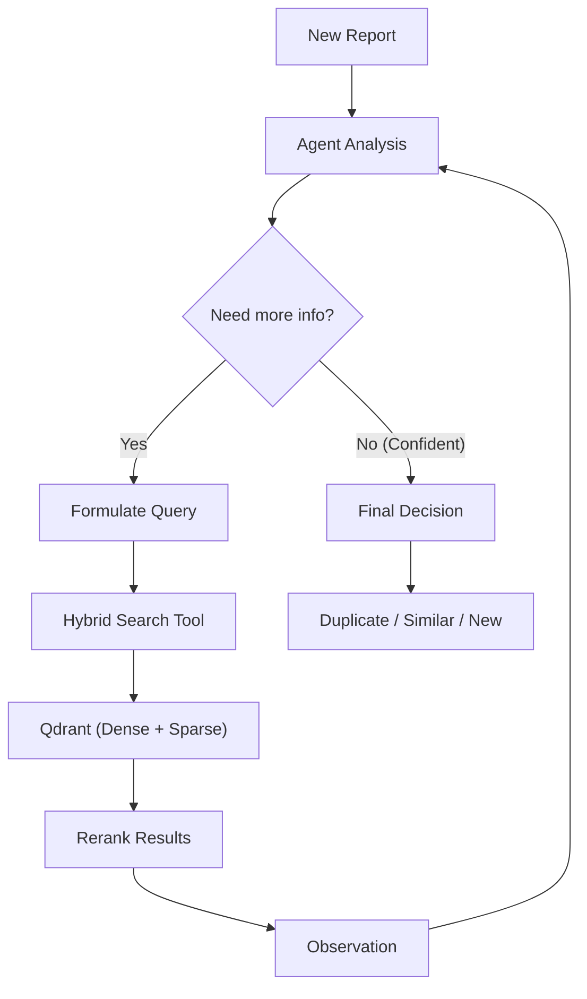

# Mnemosyne: Security Report Duplicate Detection

Mnemosyne is an intelligent system designed to detect duplicate security reports using a hybrid search approach and an agentic workflow.

## 🧠 Core Strategy: Hybrid Search + ReAct Agent

The system combines **Hybrid Search** (Semantic + Keyword) with a **ReAct Agent** (Reasoning + Acting) to achieve high accuracy in duplicate detection.

### 1. Hybrid Search (The "Eyes")
We use a dual-vector approach to find candidates:

*   **Dense Vectors (Semantic):** Uses `BAAI/bge-large-en-v1.5` (1024 dims) to understand the *meaning* of the report (e.g., "SQL Injection" is similar to "SQLi").
*   **Sparse Vectors (Keyword):** Uses `Qdrant/bm25` to match *exact keywords*, payloads, or specific paths (e.g., `'/api/v1/login'`, `'alert(1)'`).
*   **Fusion:** Results are combined using **Reciprocal Rank Fusion (RRF)** to balance semantic and keyword matches.

### 2. Re-ranking (The "Filter")
Top candidates from the hybrid search are re-ranked using **FlashRank** (`ms-marco-TinyBERT-L-2-v2`). This Cross-Encoder model looks at the query and the candidate simultaneously to provide a highly accurate relevance score.

### 3. ReAct Agent (The "Brain")
A **Claude Sonnet 4.5** agent orchestrates the process using the **ReAct pattern**:

1.  **Analyze:** The agent reads the new report.
2.  **Plan:** It decides what to search for (e.g., "Search for SQLi in login endpoint").
3.  **Act:** It calls the `hybrid_search` tool.
4.  **Observe:** It looks at the returned candidates and their scores.
5.  **Refine (Loop):**
    *   If results are ambiguous, it refines the query (e.g., "Search for specific payload `' OR '1'='1'`).
    *   It can perform up to **5 iterations** to gather evidence.
6.  **Decide:** It outputs a final verdict: `Duplicate`, `Similar`, or `New`.

## 🛠️ Models & Technology Stack

| Component | Model / Technology | Purpose |
| :--- | :--- | :--- |
| **LLM** | `claude-sonnet-4-5-20250929` | Reasoning, planning, and final decision making. |
| **Embeddings** | `BAAI/bge-large-en-v1.5` | Dense vector generation (Semantic search). |
| **Sparse** | `Qdrant/bm25` | Keyword/Payload matching. |
| **Vector DB** | **Qdrant** | Storage and hybrid search execution. |
| **Reranker** | `ms-marco-TinyBERT-L-2-v2` | High-precision re-ranking of top candidates. |
| **Framework** | **Custom ReAct** | Agent loop implementation. |

## 🔄 Agent Workflow



### Decision Thresholds

*   **🔴 Duplicate:** Score > **0.85** (Same vulnerability, same component, same payload).
*   **🟡 Similar:** Score **0.65 - 0.85** (Related vulnerability or component, but different context).
*   **🟢 New:** Score < **0.65** (No relevant tches found).

## 🚀 Key Features

*   **Iterative Refinement:** The agent doesn't just search once. It "thinks" about the results and adjusts its search strategy (e.g., switching from semantic search to payload search).
*   **Payload Matching:** High weight is given to exact matches of technical artifacts (payloads, code snippets) via BM25.
*   **Explainability:** Every decision comes with a reasoning trace explaining *why* a report was marked as a duplicate.

## 📦 Setup

### Prerequisites

*   Python 3.12+
*   Docker (for Qdrant)
*   Anthropic API Key

### Installation

1.  **Clone the repository:**
    ```bash
    git clone https://github.com/yourusername/mnemosyne.git
    cd mnemosyne
    ```

2.  **Install dependencies:**
    We recommend using `uv` for fast dependency management, but `pip` works too.

    ```bash
    # Using uv (Recommended)
    uv sync

    # Using pip
    pip install -e .
    ```

3.  **Environment Configuration:**
    Copy the example environment file and configure your keys.

    ```bash
    cp .env.example .env
    ```

    Edit `.env` and set your `ANTHROPIC_API_KEY`.

4.  **Start Qdrant:**
    Start the vector database using Docker Compose.

    ```bash
    docker-compose up -d
    ```

5.  **Initialize Mnemosyne:**
    This verifies connections and creates the Qdrant collection.

    ```bash
    mnemosyne init
    ```

## 💻 Usage

Mnemosyne provides a CLI with several commands.

### 1. Ingest Reports
Add reports to the database. Supports Markdown (`.md`) and Text (`.txt`) files.

```bash
# Ingest a single report
mnemosyne ingest data/report_123.md

# Batch ingest a directory of reports
mnemosyne ingest-batch data/bugbounty-reports/
```

### 2. Scan for Duplicates
Check if a new report is a duplicate of any existing report.

```bash
mnemosyne scan new_report.md
```

**Output:**
*   🔴 **DUPLICATE:** High confidence match found.
*   🟡 **SIMILAR:** Related reports found, manual review recommended.
*   🟢 **NEW:** No significant matches found.

### 3. View Statistics
See the status of your vector database.

```bash
mnemosyne stats
```

### 4. Test Normalization
See how Claude normalizes a report before ingestion (useful for debugging).

```bash
mnemosyne test-normalization report.md
```

## 📊 Dataset

The security reports used for training and testing this system are sourced from the [bugbounty-disclosed-reports](https://github.com/bugbounty-disclosed-reports/bugbounty-disclosed-reports) repository. We acknowledge and thank the community for maintaining this valuable dataset of disclosed security vulnerabilities.


